# VaidhID

**VaidhID** is a blockchain-inspired digital identity management mobile application built with React Native and Expo. It provides secure, ephemeral identity verification through rotating block IDs and temporary V-Cards (QR codes).

## 📋 Table of Contents

- [Features](#-features)
- [Architecture Overview](#-architecture-overview)
- [Data Flow Diagrams](#-data-flow-diagrams)
- [System Design](#-system-design)
- [Tech Stack](#️-tech-stack)
- [Prerequisites](#-prerequisites)
- [Getting Started](#-getting-started)
- [Project Structure](#-project-structure)
- [Security Service](#-security-service)
- [Main Screens](#-main-screens)
- [Development](#-development)
- [Building for Production](#-building-for-production)
- [Troubleshooting](#-troubleshooting)

## 🌟 Features

### Core Functionality
- **Blockchain-Inspired Security**: Rotating Block IDs that change every 24 hours for enhanced security
- **Ephemeral V-Cards**: Generate temporary QR codes for secure identity sharing
- **Document Management**: Store and manage digital identity documents
- **QR Code Scanning**: Scan and verify documents using the device camera
- **Secure Authentication**: Login system with user authentication
- **Real-time Chat**: Communication feature for verified users

### Security Features
- 24-hour rotating Block IDs
- Time-limited V-Card tokens
- Token verification system
- Secure document storage

## 🏗️ Architecture Overview

### High-Level System Architecture

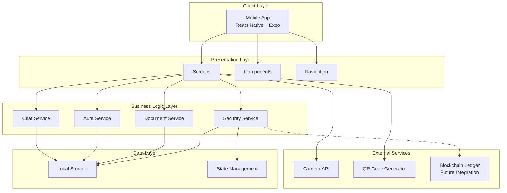
```mermaid
graph TB
    subgraph "Client Layer"
        A[Mobile App<br/>React Native + Expo]
    end
    
    subgraph "Presentation Layer"
        B[Screens]
        C[Components]
        D[Navigation]
    end
    
    subgraph "Business Logic Layer"
        E[Security Service]
        F[Document Service]
        G[Auth Service]
        H[Chat Service]
    end
    
    subgraph "Data Layer"
        I[Local Storage]
        J[State Management]
    end
    
    subgraph "External Services"
        K[Camera API]
        L[QR Code Generator]
        M[Blockchain Ledger<br/>Future Integration]
    end
    
    A --> B
    A --> C
    A --> D
    B --> E
    B --> F
    B --> G
    B --> H
    E --> I
    F --> I
    G --> I
    H --> I
    E --> J
    B --> K
    B --> L
    E -.-> M
```

### Component Architecture

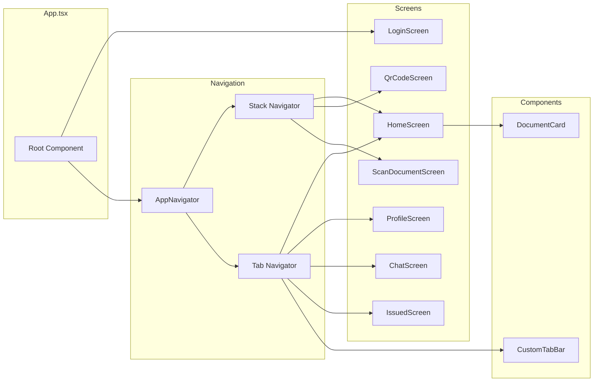
```mermaid
graph LR
    subgraph "App.tsx"
        A[Root Component]
    end
    
    subgraph "Navigation"
        B[AppNavigator]
        C[Stack Navigator]
        D[Tab Navigator]
    end
    
    subgraph "Screens"
        E[LoginScreen]
        F[HomeScreen]
        G[QrCodeScreen]
        H[ScanDocumentScreen]
        I[ProfileScreen]
        J[ChatScreen]
        K[IssuedScreen]
    end
    
    subgraph "Components"
        L[CustomTabBar]
        M[DocumentCard]
    end
    
    A --> E
    A --> B
    B --> C
    B --> D
    C --> F
    C --> G
    C --> H
    D --> F
    D --> I
    D --> J
    D --> K
    F --> M
    D --> L
```

## � Data Flow Diagrams

### Level 0 DFD - Context Diagram

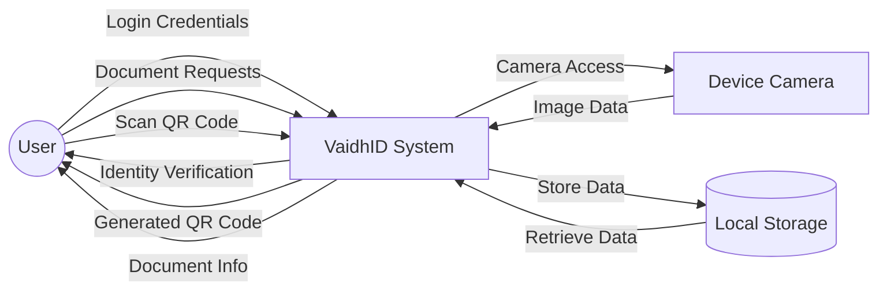
```mermaid
graph LR
    User((User))
    System[VaidhID System]
    Camera[Device Camera]
    Storage[(Local Storage)]
    
    User -->|Login Credentials| System
    User -->|Document Requests| System
    User -->|Scan QR Code| System
    System -->|Identity Verification| User
    System -->|Generated QR Code| User
    System -->|Document Info| User
    
    System -->|Camera Access| Camera
    Camera -->|Image Data| System
    
    System -->|Store Data| Storage
    Storage -->|Retrieve Data| System
```

### Level 1 DFD - Main Processes

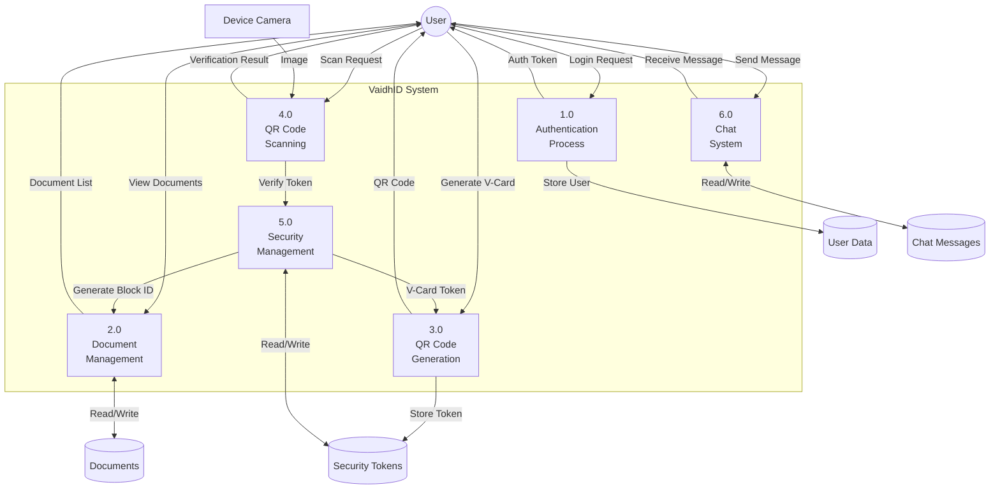
```mermaid
graph TB
    User((User))
    
    subgraph "VaidhID System"
        P1[1.0<br/>Authentication<br/>Process]
        P2[2.0<br/>Document<br/>Management]
        P3[3.0<br/>QR Code<br/>Generation]
        P4[4.0<br/>QR Code<br/>Scanning]
        P5[5.0<br/>Security<br/>Management]
        P6[6.0<br/>Chat<br/>System]
    end
    
    D1[(User Data)]
    D2[(Documents)]
    D3[(Security Tokens)]
    D4[(Chat Messages)]
    
    Camera[Device Camera]
    
    User -->|Login Request| P1
    P1 -->|Auth Token| User
    P1 -->|Store User| D1
    
    User -->|View Documents| P2
    P2 -->|Document List| User
    P2 <-->|Read/Write| D2
    
    User -->|Generate V-Card| P3
    P3 -->|QR Code| User
    P5 -->|V-Card Token| P3
    P3 -->|Store Token| D3
    
    User -->|Scan Request| P4
    Camera -->|Image| P4
    P4 -->|Verification Result| User
    P4 -->|Verify Token| P5
    P5 <-->|Read/Write| D3
    
    User -->|Send Message| P6
    P6 -->|Receive Message| User
    P6 <-->|Read/Write| D4
    
    P5 -->|Generate Block ID| P2
```

### Level 2 DFD - Authentication Process

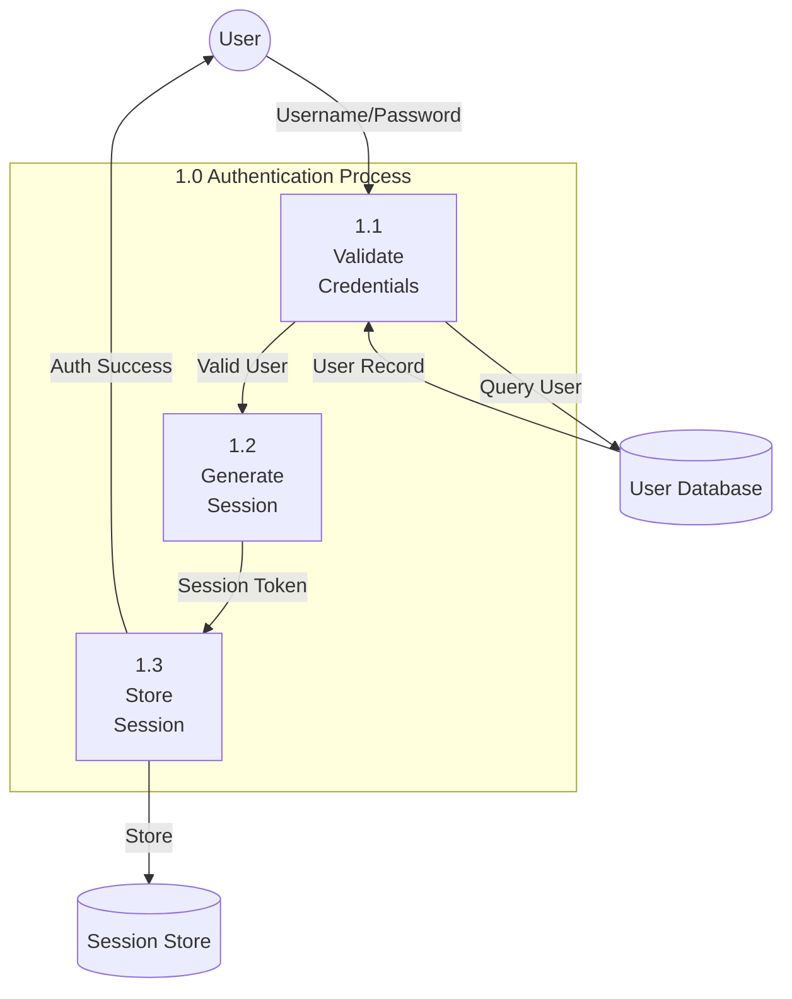
```mermaid
graph TB
    User((User))
    
    subgraph "1.0 Authentication Process"
        P1.1[1.1<br/>Validate<br/>Credentials]
        P1.2[1.2<br/>Generate<br/>Session]
        P1.3[1.3<br/>Store<br/>Session]
    end
    
    D1[(User Database)]
    D2[(Session Store)]
    
    User -->|Username/Password| P1.1
    P1.1 -->|Query User| D1
    D1 -->|User Record| P1.1
    P1.1 -->|Valid User| P1.2
    P1.2 -->|Session Token| P1.3
    P1.3 -->|Store| D2
    P1.3 -->|Auth Success| User
```

### Level 2 DFD - QR Code Generation Process

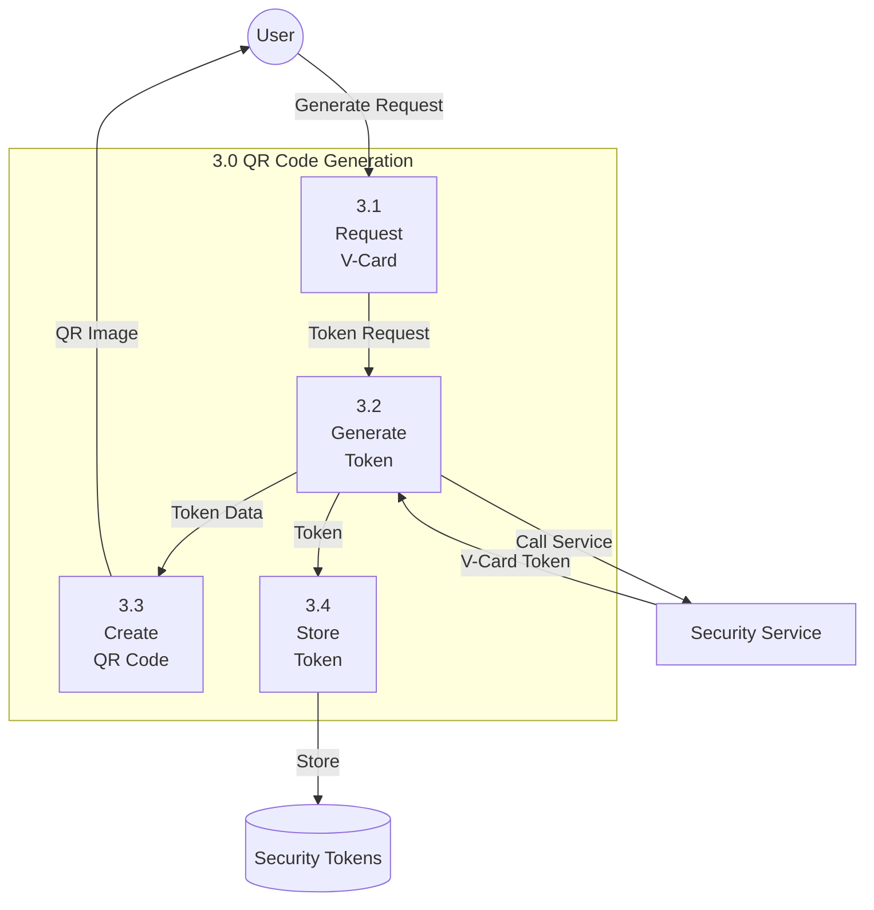
```mermaid
graph TB
    User((User))
    
    subgraph "3.0 QR Code Generation"
        P3.1[3.1<br/>Request<br/>V-Card]
        P3.2[3.2<br/>Generate<br/>Token]
        P3.3[3.3<br/>Create<br/>QR Code]
        P3.4[3.4<br/>Store<br/>Token]
    end
    
    D3[(Security Tokens)]
    SecurityService[Security Service]
    
    User -->|Generate Request| P3.1
    P3.1 -->|Token Request| P3.2
    P3.2 -->|Call Service| SecurityService
    SecurityService -->|V-Card Token| P3.2
    P3.2 -->|Token Data| P3.3
    P3.2 -->|Token| P3.4
    P3.4 -->|Store| D3
    P3.3 -->|QR Image| User
```

## 🔄 Sequence Diagrams

### User Login Flow

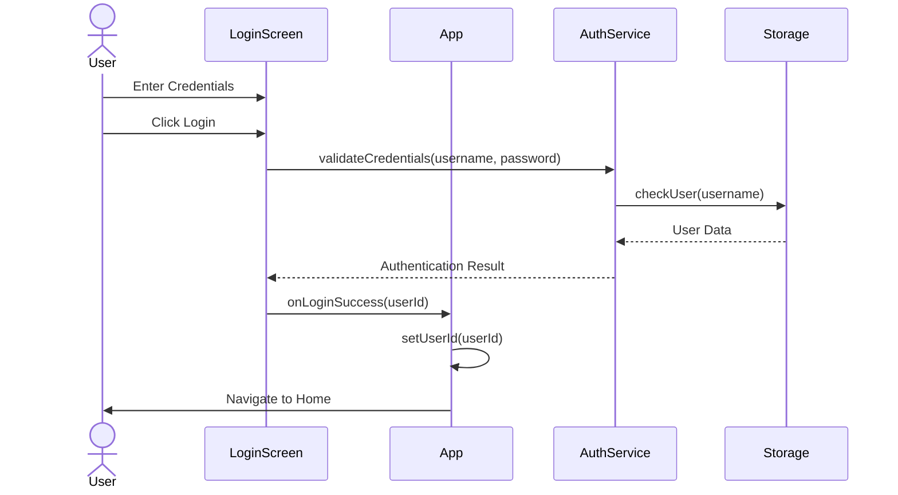
```mermaid
sequenceDiagram
    actor User
    participant LoginScreen
    participant App
    participant AuthService
    participant Storage
    
    User->>LoginScreen: Enter Credentials
    User->>LoginScreen: Click Login
    LoginScreen->>AuthService: validateCredentials(username, password)
    AuthService->>Storage: checkUser(username)
    Storage-->>AuthService: User Data
    AuthService-->>LoginScreen: Authentication Result
    LoginScreen->>App: onLoginSuccess(userId)
    App->>App: setUserId(userId)
    App->>User: Navigate to Home
```

### QR Code Generation Flow

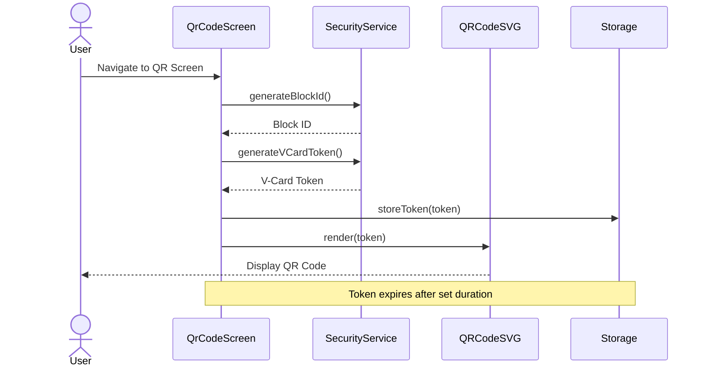
```mermaid
sequenceDiagram
    actor User
    participant QrCodeScreen
    participant SecurityService
    participant QRCodeSVG
    participant Storage
    
    User->>QrCodeScreen: Navigate to QR Screen
    QrCodeScreen->>SecurityService: generateBlockId()
    SecurityService-->>QrCodeScreen: Block ID
    QrCodeScreen->>SecurityService: generateVCardToken()
    SecurityService-->>QrCodeScreen: V-Card Token
    QrCodeScreen->>Storage: storeToken(token)
    QrCodeScreen->>QRCodeSVG: render(token)
    QRCodeSVG-->>User: Display QR Code
    
    Note over QrCodeScreen,Storage: Token expires after set duration
```

### Document Scanning Flow

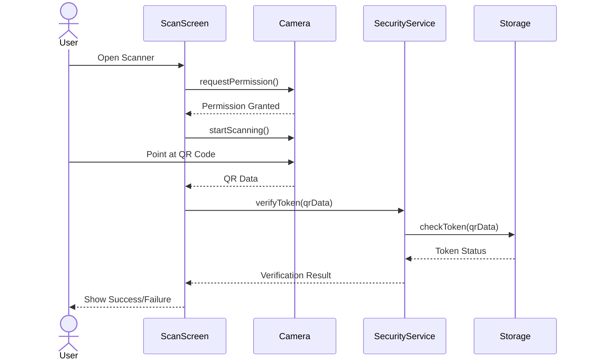
```mermaid
sequenceDiagram
    actor User
    participant ScanScreen
    participant Camera
    participant SecurityService
    participant Storage
    
    User->>ScanScreen: Open Scanner
    ScanScreen->>Camera: requestPermission()
    Camera-->>ScanScreen: Permission Granted
    ScanScreen->>Camera: startScanning()
    User->>Camera: Point at QR Code
    Camera-->>ScanScreen: QR Data
    ScanScreen->>SecurityService: verifyToken(qrData)
    SecurityService->>Storage: checkToken(qrData)
    Storage-->>SecurityService: Token Status
    SecurityService-->>ScanScreen: Verification Result
    ScanScreen-->>User: Show Success/Failure
```

### Navigation Flow

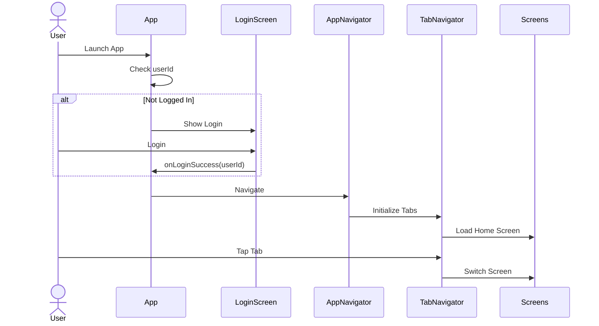
```mermaid
sequenceDiagram
    actor User
    participant App
    participant LoginScreen
    participant AppNavigator
    participant TabNavigator
    participant Screens
    
    User->>App: Launch App
    App->>App: Check userId
    alt Not Logged In
        App->>LoginScreen: Show Login
        User->>LoginScreen: Login
        LoginScreen->>App: onLoginSuccess(userId)
    end
    App->>AppNavigator: Navigate
    AppNavigator->>TabNavigator: Initialize Tabs
    TabNavigator->>Screens: Load Home Screen
    User->>TabNavigator: Tap Tab
    TabNavigator->>Screens: Switch Screen
```

## 🗂️ State Management Flow

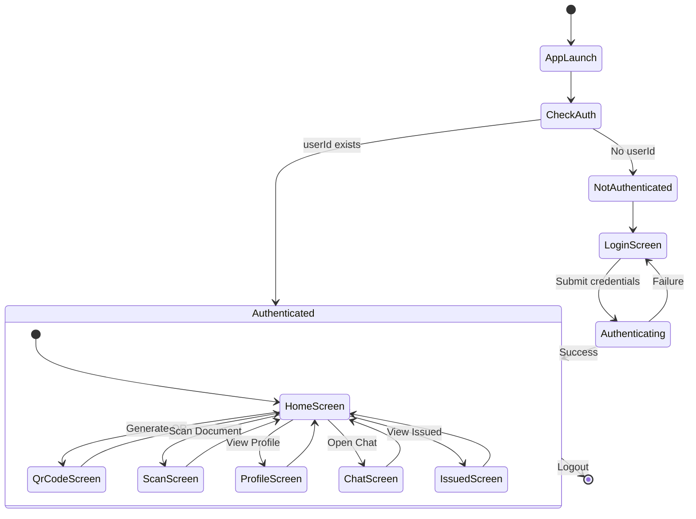
```mermaid
stateDiagram-v2
    [*] --> AppLaunch
    AppLaunch --> CheckAuth
    
    CheckAuth --> NotAuthenticated: No userId
    CheckAuth --> Authenticated: userId exists
    
    NotAuthenticated --> LoginScreen
    LoginScreen --> Authenticating: Submit credentials
    Authenticating --> Authenticated: Success
    Authenticating --> LoginScreen: Failure
    
    Authenticated --> HomeScreen
    
    state Authenticated {
        [*] --> HomeScreen
        HomeScreen --> QrCodeScreen: Generate QR
        HomeScreen --> ScanScreen: Scan Document
        HomeScreen --> ProfileScreen: View Profile
        HomeScreen --> ChatScreen: Open Chat
        HomeScreen --> IssuedScreen: View Issued
        
        QrCodeScreen --> HomeScreen
        ScanScreen --> HomeScreen
        ProfileScreen --> HomeScreen
        ChatScreen --> HomeScreen
        IssuedScreen --> HomeScreen
    }
    
    Authenticated --> [*]: Logout
```

## 🔐 Security Token Lifecycle

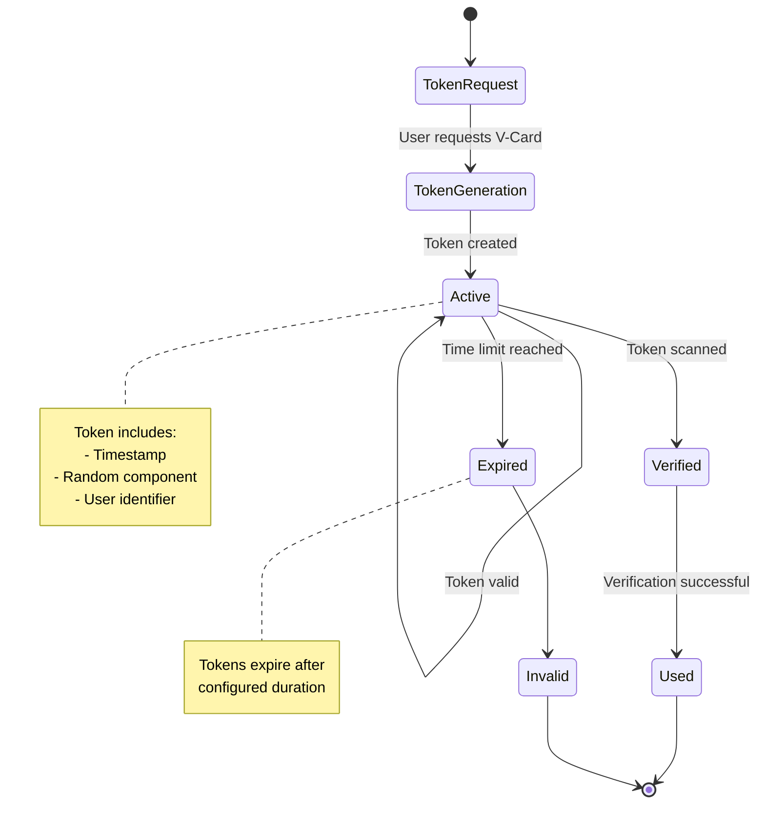
```mermaid
stateDiagram-v2
    [*] --> TokenRequest
    TokenRequest --> TokenGeneration: User requests V-Card
    
    TokenGeneration --> Active: Token created
    Active --> Active: Token valid
    Active --> Expired: Time limit reached
    Active --> Verified: Token scanned
    
    Verified --> Used: Verification successful
    Expired --> Invalid
    Used --> [*]
    Invalid --> [*]
    
    note right of Active
        Token includes:
        - Timestamp
        - Random component
        - User identifier
    end note
    
    note right of Expired
        Tokens expire after
        configured duration
    end note
```

## 🛠️ Tech Stack

- **Framework**: React Native 0.81.5
- **Platform**: Expo ~54.0.6
- **Language**: TypeScript ~5.9.2
- **Navigation**: React Navigation (Stack & Bottom Tabs)
- **UI Components**: 
  - Lucide React Native (Icons)
  - Expo Linear Gradient
  - React Native SVG
- **QR Code**: React Native QR Code SVG
- **Camera**: Expo Camera
- **Animations**: React Native Reanimated

### Technology Stack Diagram

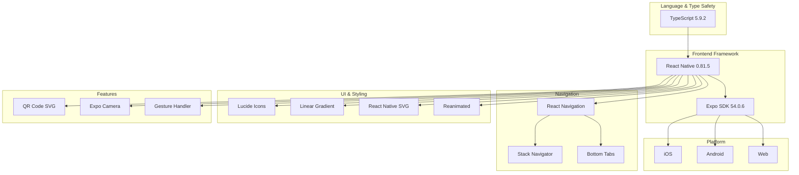
```mermaid
graph TB
    subgraph "Frontend Framework"
        A[React Native 0.81.5]
        B[Expo SDK 54.0.6]
    end
    
    subgraph "Language & Type Safety"
        C[TypeScript 5.9.2]
    end
    
    subgraph "Navigation"
        D[React Navigation]
        E[Stack Navigator]
        F[Bottom Tabs]
    end
    
    subgraph "UI & Styling"
        G[Lucide Icons]
        H[Linear Gradient]
        I[React Native SVG]
        J[Reanimated]
    end
    
    subgraph "Features"
        K[QR Code SVG]
        L[Expo Camera]
        M[Gesture Handler]
    end
    
    subgraph "Platform"
        N[iOS]
        O[Android]
        P[Web]
    end
    
    C --> A
    A --> B
    B --> N
    B --> O
    B --> P
    D --> E
    D --> F
    A --> D
    A --> G
    A --> H
    A --> I
    A --> J
    A --> K
    A --> L
    A --> M
```

## 📋 Prerequisites

Before you begin, ensure you have the following installed:
- [Node.js](https://nodejs.org/) (v16 or higher)
- [npm](https://www.npmjs.com/) or [yarn](https://yarnpkg.com/)
- [Expo CLI](https://docs.expo.dev/get-started/installation/)
- [Expo Go](https://expo.dev/client) app on your mobile device (for testing)

## 🚀 Getting Started

### Installation

1. **Clone the repository**
   ```bash
   git clone <repository-url>
   cd VaidhID
   ```

2. **Install dependencies**
   ```bash
   npm install
   ```

### Running the App

#### Development Mode

Start the Expo development server:
```bash
npm start
```

Or use specific platform commands:

- **iOS Simulator**:
  ```bash
  npm run ios
  ```

- **Android Emulator**:
  ```bash
  npm run android
  ```

- **Web Browser**:
  ```bash
  npm run web
  ```

#### Using Expo Go

1. Start the development server:
   ```bash
   npm start
   ```

2. Scan the QR code with:
   - **iOS**: Camera app
   - **Android**: Expo Go app

#### Tunnel Mode (for remote testing)

```bash
npx expo start --tunnel --clear
```

## 📁 Project Structure

```
VaidhID/
├── assets/                 # Images, icons, and static assets
├── src/
│   ├── components/        # Reusable UI components
│   │   ├── CustomTabBar.tsx
│   │   └── DocumentCard.tsx
│   ├── constants/         # App constants and configurations
│   ├── navigation/        # Navigation configuration
│   │   └── AppNavigator.tsx
│   ├── screens/          # Screen components
│   │   ├── HomeScreen.tsx
│   │   ├── LoginScreen.tsx
│   │   ├── ProfileScreen.tsx
│   │   ├── QrCodeScreen.tsx
│   │   ├── ScanDocumentScreen.tsx
│   │   ├── ChatScreen.tsx
│   │   ├── IssuedScreen.tsx
│   │   └── ProfileDetailScreens.tsx
│   └── services/         # Business logic and utilities
│       └── SecurityService.ts
├── App.tsx               # Root component
├── app.json             # Expo configuration
├── package.json         # Dependencies and scripts
└── tsconfig.json        # TypeScript configuration
```

### Directory Structure Diagram

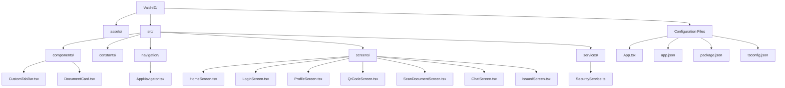
```mermaid
graph TB
    Root[VaidhID/]
    
    Root --> Assets[assets/]
    Root --> Src[src/]
    Root --> Config[Configuration Files]
    
    Src --> Components[components/]
    Src --> Constants[constants/]
    Src --> Navigation[navigation/]
    Src --> Screens[screens/]
    Src --> Services[services/]
    
    Components --> CustomTabBar[CustomTabBar.tsx]
    Components --> DocumentCard[DocumentCard.tsx]
    
    Navigation --> AppNavigator[AppNavigator.tsx]
    
    Screens --> HomeScreen[HomeScreen.tsx]
    Screens --> LoginScreen[LoginScreen.tsx]
    Screens --> ProfileScreen[ProfileScreen.tsx]
    Screens --> QrCodeScreen[QrCodeScreen.tsx]
    Screens --> ScanScreen[ScanDocumentScreen.tsx]
    Screens --> ChatScreen[ChatScreen.tsx]
    Screens --> IssuedScreen[IssuedScreen.tsx]
    
    Services --> SecurityService[SecurityService.ts]
    
    Config --> AppTsx[App.tsx]
    Config --> AppJson[app.json]
    Config --> PackageJson[package.json]
    Config --> TsConfig[tsconfig.json]
```

## 🔐 Security Service

The `SecurityService` provides blockchain-inspired security features:

### Security Service Architecture

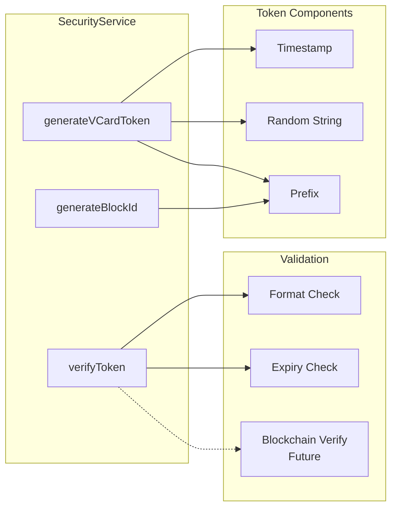
```mermaid
graph LR
    subgraph "SecurityService"
        A[generateBlockId]
        B[generateVCardToken]
        C[verifyToken]
    end
    
    subgraph "Token Components"
        D[Timestamp]
        E[Random String]
        F[Prefix]
    end
    
    subgraph "Validation"
        G[Format Check]
        H[Expiry Check]
        I[Blockchain Verify<br/>Future]
    end
    
    A --> F
    B --> D
    B --> E
    B --> F
    C --> G
    C --> H
    C -.-> I
```

### Block ID Generation
```typescript
SecurityService.generateBlockId()
// Returns: "BLK-A1B2C3D4E5F6G7H8"
```

### V-Card Token Generation
```typescript
SecurityService.generateVCardToken()
// Returns: "VCARD-1234567890-abc123de"
```

### Token Verification
```typescript
SecurityService.verifyToken(token)
// Returns: boolean
```

## 📱 Main Screens

### Screen Navigation Map

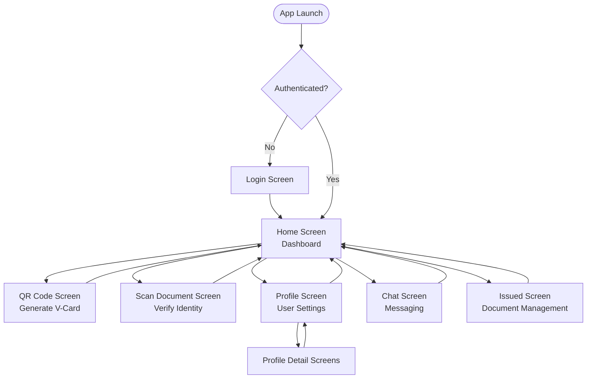
```mermaid
graph TB
    Start([App Launch])
    Start --> Login{Authenticated?}
    
    Login -->|No| LoginScreen[Login Screen]
    LoginScreen --> Home
    
    Login -->|Yes| Home[Home Screen<br/>Dashboard]
    
    Home --> QR[QR Code Screen<br/>Generate V-Card]
    Home --> Scan[Scan Document Screen<br/>Verify Identity]
    Home --> Profile[Profile Screen<br/>User Settings]
    Home --> Chat[Chat Screen<br/>Messaging]
    Home --> Issued[Issued Screen<br/>Document Management]
    
    QR --> Home
    Scan --> Home
    Profile --> ProfileDetail[Profile Detail Screens]
    ProfileDetail --> Profile
    Profile --> Home
    Chat --> Home
    Issued --> Home
```

### Home Screen
- Dashboard with document overview
- Quick access to key features
- Block ID display
- Document statistics

### QR Code Screen
- Generate ephemeral V-Cards
- Display QR codes for identity sharing
- Time-limited tokens
- Token expiration timer

### Scan Document Screen
- Camera-based QR code scanning
- Document verification
- Real-time scanning feedback
- Verification results

### Profile Screen
- User information management
- Settings and preferences
- Account details
- Security settings

### Chat Screen
- Secure messaging
- Communication with verified users
- Message history

### Issued Screen
- View issued documents
- Document management
- Issue new documents

## 🔄 Data Flow Patterns

### Document Management Flow

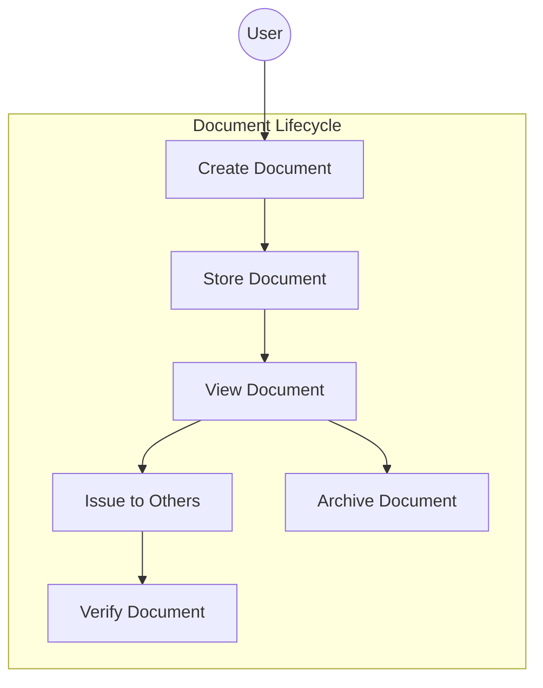
```mermaid
graph TB
    User((User))
    
    subgraph "Document Lifecycle"
        Create[Create Document]
        Store[Store Document]
        View[View Document]
        Issue[Issue to Others]
        Verify[Verify Document]
        Archive[Archive Document]
    end
    
    User --> Create
    Create --> Store
    Store --> View
    View --> Issue
    Issue --> Verify
    View --> Archive
```

### Security Token Flow

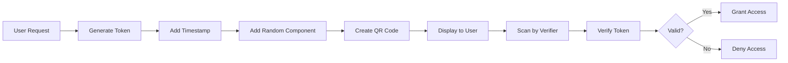
```mermaid
graph LR
    A[User Request] --> B[Generate Token]
    B --> C[Add Timestamp]
    C --> D[Add Random Component]
    D --> E[Create QR Code]
    E --> F[Display to User]
    F --> G[Scan by Verifier]
    G --> H[Verify Token]
    H --> I{Valid?}
    I -->|Yes| J[Grant Access]
    I -->|No| K[Deny Access]
```

## 🎨 Customization

### App Configuration

Edit `app.json` to customize:
- App name and slug
- Icons and splash screen
- Platform-specific settings
- Orientation and UI style

### Theme and Styling

The app uses custom styling with:
- Linear gradients
- Custom tab bar
- Responsive layouts
- Modern UI components

## 🧪 Development

### TypeScript

The project is fully typed with TypeScript. Type definitions are included for:
- React components
- Navigation props
- Service interfaces
- Custom types

### Code Structure

- **Components**: Reusable UI elements
- **Screens**: Full-page views
- **Services**: Business logic and utilities
- **Navigation**: Route configuration

### Development Workflow

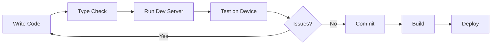
```mermaid
graph LR
    A[Write Code] --> B[Type Check]
    B --> C[Run Dev Server]
    C --> D[Test on Device]
    D --> E{Issues?}
    E -->|Yes| A
    E -->|No| F[Commit]
    F --> G[Build]
    G --> H[Deploy]
```

## 📦 Building for Production

### iOS

```bash
expo build:ios
```

### Android

```bash
expo build:android
```

### EAS Build (Recommended)

```bash
eas build --platform ios
eas build --platform android
```

### Build Process Flow

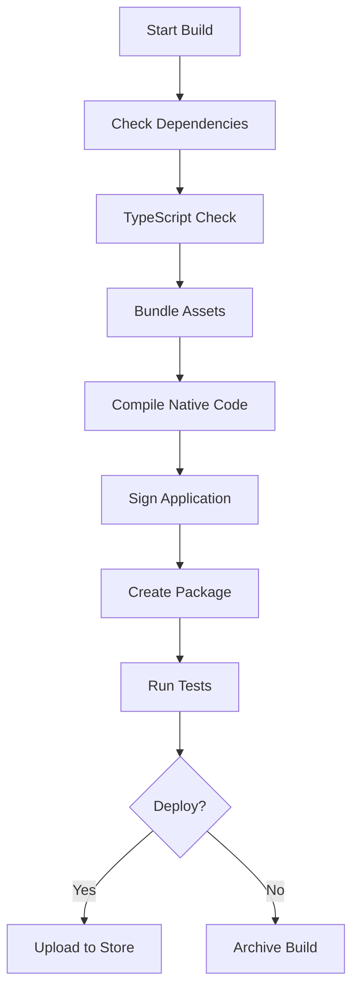
```mermaid
graph TB
    Start[Start Build] --> Check[Check Dependencies]
    Check --> TypeCheck[TypeScript Check]
    TypeCheck --> Bundle[Bundle Assets]
    Bundle --> Compile[Compile Native Code]
    Compile --> Sign[Sign Application]
    Sign --> Package[Create Package]
    Package --> Test[Run Tests]
    Test --> Deploy{Deploy?}
    Deploy -->|Yes| Store[Upload to Store]
    Deploy -->|No| Archive[Archive Build]
```

## 🐛 Troubleshooting

### Common Issues

1. **Metro bundler cache issues**
   ```bash
   npx expo start --clear
   ```

2. **Node modules issues**
   ```bash
   rm -rf node_modules
   npm install
   ```

3. **iOS Simulator not opening**
   - Ensure Xcode is installed
   - Check simulator availability

4. **Android Emulator issues**
   - Verify Android Studio installation
   - Check AVD configuration

### Debugging Flow

```mermaid
graph TB
    Issue[Encounter Issue] --> Identify[Identify Error Type]
    Identify --> Cache{Cache Issue?}
    Identify --> Dependency{Dependency Issue?}
    Identify --> Runtime{Runtime Error?}
    
    Cache -->|Yes| ClearCache[Clear Cache]
    ClearCache --> Restart[Restart Server]
    
    Dependency -->|Yes| Reinstall[Reinstall Dependencies]
    Reinstall --> Restart
    
    Runtime -->|Yes| CheckLogs[Check Error Logs]
    CheckLogs --> Debug[Debug Code]
    Debug --> Fix[Apply Fix]
    Fix --> Test[Test Solution]
    
    Restart --> Test
    Test --> Resolved{Resolved?}
    Resolved -->|No| Issue
    Resolved -->|Yes| Done[Done]
```

## 📊 Performance Considerations

### Optimization Strategy

```mermaid
graph TB
    subgraph "Performance Optimization"
        A[Code Splitting]
        B[Lazy Loading]
        C[Image Optimization]
        D[Bundle Size Reduction]
        E[Memory Management]
    end
    
    subgraph "Monitoring"
        F[Performance Metrics]
        G[Error Tracking]
        H[User Analytics]
    end
    
    A --> F
    B --> F
    C --> F
    D --> F
    E --> F
    F --> G
    F --> H
```

## 📄 License

This project is private and proprietary.

## 👥 Contributing

This is a private project. For contribution guidelines, please contact the project maintainers.

## 📞 Support

For issues, questions, or support, please contact the development team.

---

**Version**: 1.0.0  
**Last Updated**: December 2025  
**Maintained by**: VaidhID Development Team
